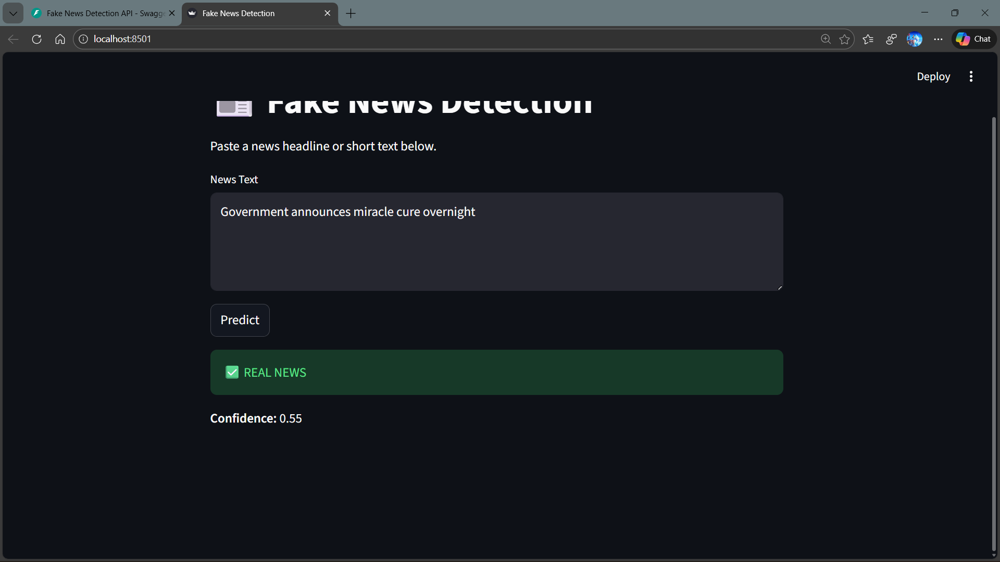
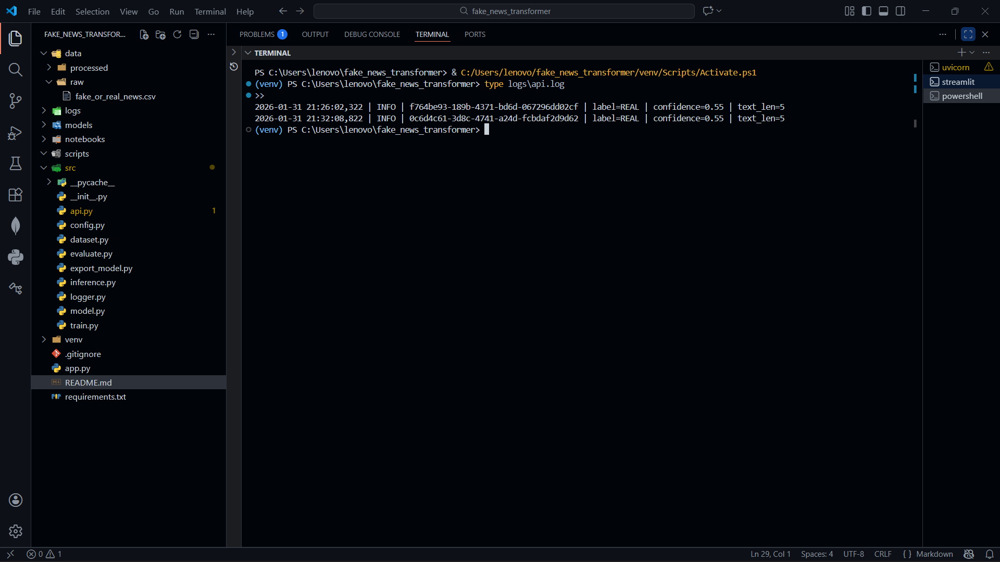

# Fake News Detection System

An end-to-end fake news detection system with a production-ready backend,
web UI, logging, and an ML-ready inference interface.

> Note: The current predictor uses a stub model. A transformer-based model
> can be plugged in without changing the API or UI.

---

## Architecture

Streamlit UI → FastAPI Backend → Predictor Interface → Logs

- **UI**: Streamlit (client)# Fake News Detection System

A production-oriented fake news detection system demonstrating
end-to-end system design, API development, logging, and ML-ready architecture.

This project prioritizes **correct system boundaries and observability**
over premature model optimization.

---

## Problem Statement

Fake news detection is not just a classification problem —
it is a **system design problem** involving data ingestion,
model inference, observability, and safe deployment.

This project focuses on building a **robust, production-ready pipeline**
where machine learning models can be iterated without breaking the system.

---

## Architecture Overview

Streamlit UI → FastAPI Backend → Predictor Interface → Logs

- **UI**: User-facing client (Streamlit)
- **API**: Stable REST service (FastAPI)
- **Inference Layer**: Modular predictor abstraction
- **Observability**: Request-level logging with trace IDs

The ML model is intentionally isolated so it can be swapped
without modifying the API or UI.

---

## Key Design Decisions

- **FastAPI** for clear API contracts and automatic documentation
- **Streamlit** for rapid, user-friendly demos
- **Stub predictor** used initially to stabilize production flow
- **Logging-first approach** to enable debugging and auditability
- **ML isolation** to prevent model changes from affecting clients

---

## Features

- REST API (`POST /predict`)
- Interactive web interface
- Request tracing with unique request IDs
- Rotating file-based logging
- ML-ready inference boundary

---

## API Example

### Request
```json
{
  "text": "Government announces miracle cure overnight"
}

- **Backend**: FastAPI
- **Inference**: Modular predictor interface (ML-ready)
- **Observability**: File-based logging with request IDs

---

## Features

- REST API (`POST /predict`)
- Interactive web UI
- Request tracing with unique request IDs
- Rotating log files
- Clean separation between API and ML logic

---

## Tech Stack

- Python
- FastAPI
- Streamlit
- PyTorch (model-ready)
- Logging (RotatingFileHandler)

---

## API Usage

### Endpoint
`POST /predict`

### Request
```json
{
  "text": "Government announces miracle cure overnight"
}

## Screenshots

### Streamlit UI


### FastAPI Docs


### Logs

